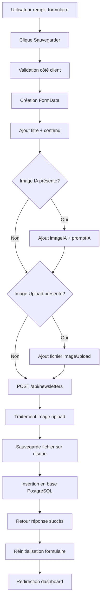

# 💾 Implémentation Sauvegarde PostgreSQL - Newsletter

## 🎯 Fonctionnalités Implémentées

### **1. Base de Données PostgreSQL**
- ✅ **Table newsletters** avec structure complète
- ✅ **Gestion des images** (IA + Upload)
- ✅ **Métadonnées** (prompt, statut, dates)
- ✅ **Triggers automatiques** pour updated_at

### **2. API Routes Complètes**
- ✅ **GET** `/api/newsletters` - Récupération avec pagination
- ✅ **POST** `/api/newsletters` - Création avec images
- ✅ **PUT** `/api/newsletters?id=X` - Mise à jour
- ✅ **DELETE** `/api/newsletters?id=X` - Suppression avec cleanup

### **3. Interface Utilisateur**
- ✅ **Formulaire de création** avec validation
- ✅ **Sauvegarde automatique** des images
- ✅ **États de chargement** (génération IA + sauvegarde)
- ✅ **Feedback utilisateur** complet

## 🗄️ Structure de la Base de Données

### **Table `newsletters` :**
```sql
CREATE TABLE newsletters (
    id SERIAL PRIMARY KEY,
    titre VARCHAR(255) NOT NULL,
    contenu TEXT NOT NULL,
    image_ia_url VARCHAR(500),           -- URL publique image IA
    image_ia_filename VARCHAR(255),      -- Nom fichier image IA
    image_upload_url VARCHAR(500),       -- URL publique image uploadée
    image_upload_filename VARCHAR(255),  -- Nom fichier image uploadée
    prompt_ia TEXT,                      -- Prompt utilisé pour l'IA
    statut VARCHAR(50) DEFAULT 'brouillon',
    created_at TIMESTAMP DEFAULT CURRENT_TIMESTAMP,
    updated_at TIMESTAMP DEFAULT CURRENT_TIMESTAMP
);
```

### **Index et Triggers :**
```sql
-- Index pour performance
CREATE INDEX idx_newsletters_created_at ON newsletters(created_at DESC);
CREATE INDEX idx_newsletters_statut ON newsletters(statut);
CREATE INDEX idx_newsletters_titre ON newsletters(titre);

-- Trigger pour updated_at automatique
CREATE TRIGGER update_newsletters_updated_at
    BEFORE UPDATE ON newsletters
    FOR EACH ROW
    EXECUTE FUNCTION update_updated_at_column();
```

## 📁 Gestion des Fichiers

### **Structure des Dossiers :**
```
public/
└── uploads/
    ├── newsletter-1642784523000.webp    # Images IA (Stability AI)
    ├── upload-1642784567000.jpg         # Images uploadées
    └── ...
```

### **Nommage des Fichiers :**
- **Images IA** : `newsletter-{timestamp}.webp`
- **Images Upload** : `upload-{timestamp}.{extension}`

### **URLs Publiques :**
- **Images IA** : `/uploads/newsletter-1642784523000.webp`
- **Images Upload** : `/uploads/upload-1642784567000.jpg`

## 🔧 Configuration

### **Variables d'Environnement (.env.local) :**
```bash
# PostgreSQL
POSTGRES_USER=postgres
POSTGRES_HOST=localhost
POSTGRES_DB=newsletter_kcs
POSTGRES_PASSWORD=password
POSTGRES_PORT=5432

# Stability AI
STABILITY_API_KEY=sk-n5CsxrpcldMbHc7jTiuPGvkxBhGdqFuZhfshmcJAQkaXyFPx
```

### **Initialisation Base de Données :**
```bash
# Créer la base de données
createdb newsletter_kcs

# Initialiser les tables
npm run init-db
```

## 📋 API Endpoints

### **1. GET /api/newsletters**
```javascript
// Récupérer toutes les newsletters
GET /api/newsletters?limit=10&offset=0&statut=brouillon

Response:
{
  "success": true,
  "newsletters": [
    {
      "id": 1,
      "titre": "Newsletter KCS - Mars 2024",
      "contenu": "Contenu de la newsletter...",
      "image_ia_url": "/uploads/newsletter-1642784523000.webp",
      "image_ia_filename": "newsletter-1642784523000.webp",
      "image_upload_url": "/uploads/upload-1642784567000.jpg",
      "image_upload_filename": "upload-1642784567000.jpg",
      "prompt_ia": "Professional newsletter header design...",
      "statut": "brouillon",
      "created_at": "2024-03-15T10:30:00Z",
      "updated_at": "2024-03-15T10:30:00Z"
    }
  ],
  "total": 1
}
```

### **2. POST /api/newsletters**
```javascript
// Créer une nouvelle newsletter
const formData = new FormData()
formData.append('titre', 'Newsletter KCS - Mars 2024')
formData.append('contenu', 'Contenu de la newsletter...')
formData.append('imageIA', '/uploads/newsletter-1642784523000.webp')
formData.append('promptIA', 'Professional newsletter header design...')
formData.append('imageUpload', fileObject) // File object

POST /api/newsletters
Body: FormData

Response:
{
  "success": true,
  "newsletter": { /* newsletter créée */ },
  "message": "Newsletter créée avec succès"
}
```

### **3. PUT /api/newsletters?id=1**
```javascript
// Mettre à jour une newsletter
const formData = new FormData()
formData.append('titre', 'Nouveau titre')
formData.append('contenu', 'Nouveau contenu')
formData.append('statut', 'publiée')

PUT /api/newsletters?id=1
Body: FormData

Response:
{
  "success": true,
  "newsletter": { /* newsletter mise à jour */ },
  "message": "Newsletter mise à jour avec succès"
}
```

### **4. DELETE /api/newsletters?id=1**
```javascript
// Supprimer une newsletter (+ cleanup fichiers)
DELETE /api/newsletters?id=1

Response:
{
  "success": true,
  "message": "Newsletter supprimée avec succès"
}
```

## 🎨 Interface Utilisateur

### **États de l'Interface :**
```javascript
const [formData, setFormData] = useState({
  titre: '',
  contenu: '',
  imageIA: '',
  imageUpload: null
})

const [isGeneratingImage, setIsGeneratingImage] = useState(false)
const [isSaving, setIsSaving] = useState(false)
const [lastPrompt, setLastPrompt] = useState('')
```

### **Bouton de Sauvegarde :**
```jsx
<button
  type="submit"
  disabled={isSaving}
  className="inline-flex items-center space-x-2 px-6 py-2 rounded-lg"
>
  {isSaving ? (
    <>
      <Loader2 size={16} className="animate-spin" />
      <span>Sauvegarde...</span>
    </>
  ) : (
    <>
      <Save size={16} />
      <span>Créer la newsletter</span>
    </>
  )}
</button>
```

## 🔄 Flux de Sauvegarde



## 🛡️ Sécurité et Validation

### **Validation Côté Client :**
- **Titre obligatoire** : Minimum 1 caractère
- **Contenu obligatoire** : Minimum 1 caractère
- **Types de fichiers** : Images uniquement
- **Taille maximale** : 10MB par image

### **Validation Côté Serveur :**
- **Paramètres requis** : Titre et contenu
- **Sanitisation** : Échappement SQL automatique (pg)
- **Gestion d'erreurs** : Try/catch complet
- **Cleanup automatique** : Suppression fichiers orphelins

### **Gestion des Erreurs :**
```javascript
try {
  // Traitement
} catch (error) {
  console.error('Erreur:', error)
  return NextResponse.json(
    { error: 'Message d\'erreur explicite' },
    { status: 500 }
  )
}
```

## 🚀 Installation et Utilisation

### **1. Configuration PostgreSQL :**
```bash
# Installer PostgreSQL
# Créer la base de données
createdb newsletter_kcs

# Copier les variables d'environnement
cp .env.local.example .env.local
# Modifier les valeurs dans .env.local
```

### **2. Initialisation :**
```bash
# Installer les dépendances
npm install

# Initialiser la base de données
npm run init-db

# Démarrer le serveur
npm run dev
```

### **3. Test de Fonctionnement :**
1. **Aller sur** : http://localhost:3001/admin-postgres/nouvelle-newsletter
2. **Remplir le formulaire** : Titre + Contenu
3. **Générer une image IA** (optionnel)
4. **Uploader une image** (optionnel)
5. **Cliquer "Créer la newsletter"**
6. **Vérifier** : Base de données + fichiers dans `/uploads/`

---

## 🎉 **Implémentation Complète !**

Le système de sauvegarde PostgreSQL est maintenant opérationnel avec :
- ✅ **Base de données** structurée et optimisée
- ✅ **API complète** (CRUD + gestion fichiers)
- ✅ **Interface utilisateur** avec états de chargement
- ✅ **Gestion des images** (IA + Upload)
- ✅ **Sécurité** et validation complètes
- ✅ **Scripts d'initialisation** automatisés

**🔗 Prêt à utiliser :**
http://localhost:3001/admin-postgres/nouvelle-newsletter

---

*Système de sauvegarde PostgreSQL complet et robuste* ✨
